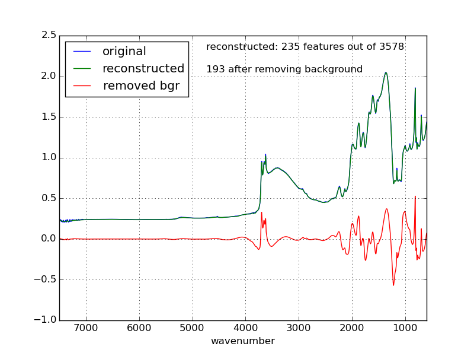

Dimensionality Reduction
========================

Given is the data frame (10x3578) with 10 spectra, 3578 (nonzero) measurements for each

Each spectrum (here also called signal) is denoised and encoded so that it is 
    described by a few hundred (depending on the denoising coefficient) nonzero values
Background can also be removed    
This technique can be used for any time series as dimentionaly reduction technique
Extracted nonzero values can be considered as nontrivial features and used further 
    in various machine learning algorithms
Similar techniques can be used (and are used) for image processing

